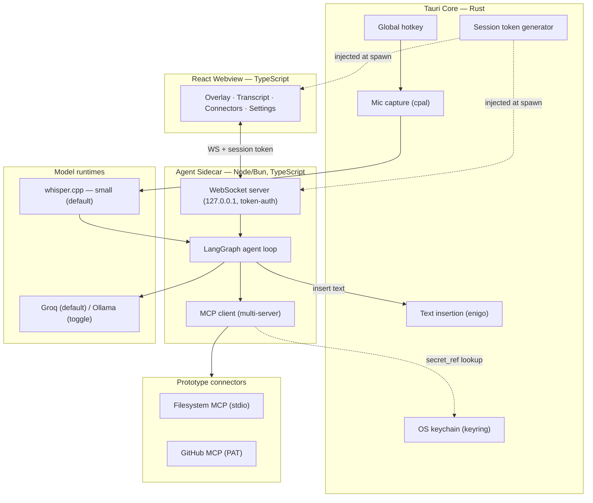

# Product Requirements Document

**Product:** Open-source, local-first voice agent for desktop
**Document version:** 1.1 (Prototype scope)
**Status:** Approved for prototype development
**Platforms:** macOS + Windows (Linux deferred)
**Last updated:** July 6, 2026
**License:** Apache-2.0 (decided before first public commit)

---

## 0. Changes from v1.0

This revision narrows v1.0 from a full MVP to a **working end-to-end prototype**. Key changes:

1. **Platform scope:** macOS + Windows only. Linux deferred (Wayland breaks global hotkeys and synthetic input).
2. **Latency budget added:** ≤3s from key-release to response start. Default STT model changed from `large-v3` to `small`.
3. **LLM default flipped for prototyping:** Groq (cloud) is the default; Ollama (local) remains a toggle. Local-first stays the product vision; cloud-first is a prototyping tactic to isolate code bugs from model failures.
4. **Reference connectors changed:** Gmail dropped (forces OAuth). Prototype connectors are **Filesystem (stdio, no auth)** and **GitHub (PAT, paste-in)**. OAuth 2.1 flow deferred.
5. **Feature set cut** from 15 features to 8 (see §4). TTS, voice follow-ups, memory, VLM, full history deferred.
6. **Security additions:** token-authenticated localhost WebSocket; prompt-injection claim reframed as defense-in-depth with confirm-before-acting as the primary control.
7. **New sections:** first-run/permissions onboarding, prototype success criteria, build order, non-goals.
8. **Distribution:** unsigned builds for the prototype. Code signing/notarization deferred to public release.

---

## 1. Product Overview

### 1.1 Vision (unchanged)

A voice-first desktop agent that lets people *do their work by speaking* — complete real tasks across their own tools while keeping everything private and local by default. Press a key, speak the intent, and the agent carries it out without breaking your flow.

### 1.2 Prototype goal

Prove the complete loop works reliably on real machines:

> **Hold hotkey → speak → local transcription → agent plans → calls a real connector (GitHub / filesystem) → pauses for confirmation on side effects → shows result in transcript / inserts text at cursor.**

If this loop works, the concept is proven. Everything deferred is additive.

### 1.3 Prototype success criteria

| # | Criterion | Pass condition |
|---|---|---|
| S1 | End-to-end latency | ≤3s from hotkey release to first visible response for a simple command, on a mid-range laptop (no dGPU) |
| S2 | Reference task: system action | "Open my Documents folder" succeeds on macOS and Windows |
| S3 | Reference task: read-only connector | "Show my most-starred GitHub repos" returns correct results in the transcript |
| S4 | Reference task: side-effecting connector | "Create a markdown file named X with Y" pauses for confirmation, then executes only after explicit approval |
| S5 | Reference task: dictation-that-acts | Spoken text is inserted at the cursor in a third-party app (e.g., a text editor) |
| S6 | Confirmation gate coverage | 100% of side-effecting tool calls (create, write, delete, push) trigger the confirm interrupt |
| S7 | Provider toggle | Switching Groq ↔ Ollama in config changes the provider with zero code change; S2–S4 pass on Groq; S2–S3 pass on a recommended local model |
| S8 | Clean failure | Denied confirmation, connector errors, and empty transcriptions produce a clear transcript message, never a crash or silent hang |

### 1.4 Non-goals (prototype)

- Linux support
- OAuth flows of any kind (Gmail, Google Docs, etc.)
- Text-to-speech output (responses are text-only in the transcript)
- Voice-based clarifying follow-ups (clarifications appear as text; user re-invokes hotkey to answer)
- Long-term memory / vector store
- Screen-context (VLM) mode
- Wake-word / hands-free activation
- In-app LLM model downloading or Ollama bundling
- Code signing, notarization, auto-update
- Multi-device sync, teams, telemetry

---

## 2. App Name

Carried over from v1.0: shortlist **Parla** and **Cue** for trademark screening. Use a neutral working codename in the repo until screening completes.

---

## 3. Product Description

### 3.1 What the prototype does

A desktop utility living in the menu bar / system tray. The user holds a global hotkey, speaks a command, and releases. Audio is transcribed locally by whisper.cpp, interpreted by a LangGraph agent, and executed — via a system action, an MCP connector call, or text insertion at the cursor. Side-effecting actions pause for explicit confirmation in the overlay. All responses render as text in a session transcript.

### 3.2 Target audience (prototype phase)

Power users and developers willing to install a prerequisite (Ollama, optionally) and run unsigned builds. The broader audiences from v1.0 (everyday professionals, enterprises, accessibility users) remain the product target but are not served until first-run polish, signing, and TTS land.

### 3.3 Prototype use cases

1. **File/system control** — "Open my Documents folder."
2. **Repo lookups** — "Show my most-starred GitHub repos." / "Any open issues assigned to me?"
3. **File creation with confirmation** — "Create a markdown file called meeting-notes with today's date as the heading."
4. **Dictation-that-acts** — speak into any focused app and have text inserted at the cursor.

---

## 4. Features (Prototype)

| # | Feature | Description | Notes / changes from v1.0 |
|---|---|---|---|
| P1 | Push-to-talk capture | Global hotkey (Rust core) starts listening; Silero VAD trims silence; release ends capture. Works while any app is focused. | Unchanged (was F1) |
| P2 | Local speech-to-text | whisper.cpp transcribes on-device. **Default model: `small`** (`base.en` acceptable for English-only). Model size is a settings value. `large-v3` opt-in only. | Changed default (was F2 with large-v3) |
| P3 | Agent orchestration loop | LangGraph.js loop plans, selects tools, executes multi-step tasks; interrupt support for confirmations. | Unchanged (was F3) |
| P4 | Provider toggle | Groq (default) ↔ Ollama via one OpenAI-compatible abstraction. **Config-file toggle is acceptable; settings UI optional.** | Default flipped (was F4) |
| P5 | Minimal connectors tab | Add/remove/enable MCP servers: stdio (command + args) and remote (URL + pasted token). Connection test + tool list. No catalog, no OAuth. | Trimmed (was F5) |
| P6 | Text insertion | Insert generated/transcribed text at the cursor in any app via `enigo`. Known limitation: fails in secure input fields — show a transcript fallback message. | Unchanged (was F6) |
| P7 | Confirm-before-acting | Every side-effecting tool call pauses the graph and renders an approve/deny card in the overlay. Deny cancels cleanly with a transcript note. | Unchanged (was F7) — **primary security control** |
| P8 | Session transcript | Text rendering of every user utterance, agent message, tool call, and confirmation for the current session. Copy supported. No persistence across restarts. | Trimmed (was F9 + partial F10) |
| P9 | First-run permissions (macOS) | Minimal onboarding screen: check mic + Accessibility permissions, deep-link to System Settings, re-check button. Windows: no-op. | **New** |
| P10 | Secret storage (minimal) | GitHub PAT and Groq API key stored in OS keychain via Tauri keyring; DB/config stores only `secret_ref`. Paste-in UI only. | Trimmed (was F13) |

**Deferred to post-prototype:** TTS (F11), voice follow-ups (F8), transcript persistence (F10), memory (F12), VLM (F14), auto-listen (F15), OAuth, connector catalog, code signing, auto-update.

---

## 5. System Architecture

### 5.1 High-level overview (unchanged shape, trimmed contents)

Four layers on one machine: **React webview** (UI), **Rust core** (Tauri: OS capabilities), **TypeScript agent sidecar** (reasoning + tool orchestration), and **model runtimes + connectors**. The webview never touches OS APIs or secrets; the sidecar never renders UI.

### 5.2 Architecture diagram

### 5.3 Architecture decisions (carried over + new)

| Decision | Reasoning |
|---|---|
| Tauri over Electron | Smaller footprint; Rust core for secure OS access; native hotkey/keyring plugins. |
| Agent in a sidecar | Webview can't spawn stdio MCP processes or hold secrets. Sidecar isolates tool execution and credentials. |
| OS work stays in Rust | Global hotkey while unfocused, mic capture, cross-app text insertion are impossible in a webview. |
| LangGraph for the agent | Interrupts/checkpointing are exactly what confirm-before-acting requires. |
| MCP for tools | Users add servers at runtime; capability grows without shipping integrations. |
| One OpenAI-compatible provider abstraction | Groq ↔ Ollama is a settings value, not a code branch. |
| **NEW — Groq default during prototyping** | Small local models fail multi-step tool-calling often; a strong cloud model isolates "my code is broken" from "the model is weak." Local mode validated as a second pass (S7). |
| **NEW — Token-authenticated localhost WebSocket** | Any local process can hit a localhost port. Rust core generates a random session token at startup, injects it into the webview and sidecar at spawn; the sidecar binds to 127.0.0.1 only and rejects unauthenticated connections. |
| **NEW — Node fallback rule for the sidecar** | Bun is preferred (single-binary compile), but native bindings (keyring bridge, whisper, sqlite) must be smoke-tested under Bun in week 1. Any breakage → switch to Node immediately; nothing architectural changes. |

### 5.4 Workflow (prototype)

1. **Idle** — tray icon + small always-on-top indicator.
2. **Invoke** — user holds hotkey; indicator shows listening.
3. **Capture** — mic buffered; VAD trims silence; release ends capture.
4. **Transcribe** — whisper.cpp (`small`) → text. Empty/garbage transcription → transcript notice, back to idle.
5. **Plan** — LangGraph agent interprets intent; selects system action, MCP tool, text insertion, or direct answer.
6. **Confirm (conditional)** — any side-effecting tool call pauses the graph; overlay shows the tool, params, and approve/deny. Deny → clean cancel.
7. **Act** — tool executes; errors surface in the transcript.
8. **Deliver** — response rendered in transcript; if the intent was dictation, text is inserted at the cursor.
9. **Clarify (text-only)** — if the agent needs input, it renders the question in the transcript; user re-presses the hotkey to answer, and the graph resumes from its checkpoint.

---

## 6. Technology Stack (prototype)

| Layer | Choice | Notes |
|---|---|---|
| App shell | Tauri 2 (Rust) | global-shortcut, tray, keyring plugins |
| Frontend | React + Vite + TypeScript | |
| UI components | shadcn/ui (Radix + Tailwind) | |
| Agent runtime | **Bun preferred, Node fallback** — decision gate in week 1 (native-binding smoke test) | |
| Agent framework | LangGraph.js + `@langchain/mcp-adapters` | |
| Model integrations | `@langchain/groq` (default), `@langchain/ollama` (toggle) | |
| Cloud LLM | Groq — Llama-3.3-70B or Qwen (tool-calling capable) | free tier acceptable for prototype |
| Local LLM | Ollama, recommended model ≥8B with tool-calling (e.g., Qwen 3 8B) | documented prerequisite, not bundled |
| STT | whisper.cpp — `small` default, `base.en` low-end option, `large-v3` opt-in | model file downloaded by first-run script |
| VAD | Silero VAD | |
| TTS | — (deferred) | |
| Config store | SQLite (or JSON config file — either acceptable at this scope) | |
| Secret storage | OS keychain via Tauri keyring | values never in DB/config |
| OS-level libs | `cpal` (mic), `enigo` (text insertion), Tauri `global-shortcut` | `xcap` deferred with VLM |
| Connectors | Filesystem MCP server (stdio), GitHub MCP server (PAT) | |
| Distribution | Unsigned dev builds (`tauri build`) | signing/notarization deferred |

**Prerequisites (documented in README):** Ollama installed only if local mode is used; Groq API key only if cloud mode is used. whisper.cpp model file fetched by a first-run download (single file, with progress).

**Hardware guidance:** cloud mode — any modern laptop; local mode — ≥16GB RAM recommended for an 8B model + whisper `small`.

---

## 7. Data Design (prototype)

Persistence is deliberately minimal.

| Store | Contents | Notes |
|---|---|---|
| `connectors` (SQLite/JSON) | `id`, `name`, `transport` (stdio/http), `command`/`args` or `url`, `enabled`, `secret_ref` | |
| `settings` (SQLite/JSON) | `hotkey`, `llm_provider`, `llm_model`, `stt_model` | |
| OS keychain | GitHub PAT, Groq API key, remote-connector tokens | keyed by `secret_ref`; values never touch disk config |
| In-memory session | transcript turns, action log for the current session | not persisted across restarts (deferred) |

Audio is never persisted: buffered → transcribed → discarded.

---

## 8. Internal API (prototype)

No public API. Two internal channels:

### 8.1 Agent channel — event-driven WebSocket (webview ↔ sidecar)

- Bound to `127.0.0.1`; every connection must present the session token (first message or header) or is dropped.
- Inbound: `user_utterance`, `confirm_response {approved}`, `resume`
- Outbound: `assistant_message`, `tool_running`, `confirm_request {tool, params}`, `need_input`, `error`, `done`

### 8.2 Control channel — Tauri IPC command/response

- Connectors: `listConnectors`, `addServer`, `removeServer`, `testConnection`, `listTools`
- Settings: `getSettings`, `updateSettings`
- Secrets: `storeSecret`, `getSecret(secret_ref)`, `deleteSecret` (core-side only; sidecar requests via authenticated channel)
- System: `openPath`, `insertText`
- Permissions (macOS): `checkPermissions`, `openSystemSettings`

### 8.3 Authentication

- **Groq:** API key from keychain, bearer header, sidecar-side only.
- **GitHub connector:** user pastes a PAT; stored in keychain; attached as header by the MCP client.
- **Remote MCP generally:** BYO-token only in the prototype. OAuth 2.1 + PKCE deferred (design from v1.0 §8.1 remains the plan).

---

## 9. Security (prototype posture)

1. **Confirm-before-acting is the primary control.** LLMs — especially local ones — cannot be trusted to ignore instructions embedded in tool results or email/file content. The prototype does **not** claim injection immunity; instead:
   - every side-effecting tool call requires explicit user approval showing the exact tool and parameters;
   - tool results are treated as data in prompting, as defense-in-depth, not as a guarantee;
   - no chain from untrusted content to a side-effecting call can complete without the confirm gate.
2. **IPC authentication.** Random per-session token generated by the Rust core, injected into webview and sidecar at spawn; WebSocket bound to `127.0.0.1`; unauthenticated connections rejected.
3. **Secret isolation.** All credentials in the OS keychain; config carries only references; secrets never logged.
4. **stdio safety.** Local connector commands are shown to the user verbatim before first run and require explicit enable; no auto-start of newly added stdio servers.
5. **Known accepted risks (prototype):** unsigned builds (OS warnings expected), transcripts unencrypted in memory only (no at-rest transcript store yet), no sandboxing of stdio MCP processes.

---

## 10. Build Order & Milestones

Each milestone is independently demoable. Estimated for one developer; adjust to taste.

| M | Milestone | Proves | Exit test |
|---|---|---|---|
| M1 | Tauri shell + tray + global hotkey + mic capture (Rust) | Audio lands in a buffer on key-hold | Log buffer length on release, both OSes |
| M2 | whisper.cpp integration + VAD + first-run model download | Hotkey → accurate text ≤1.5s for a 10s utterance | Speak 10 commands, ≥9 usable transcriptions |
| M3 | Sidecar + token-auth WebSocket + transcript UI | Webview ↔ sidecar messaging; **Bun/Node decision gate** | Round-trip message; unauthenticated connect rejected |
| M4 | LangGraph loop + Groq + Filesystem MCP (stdio) | "Open my Documents folder" end-to-end | S2 passes |
| M5 | GitHub MCP + PAT in keychain + minimal connectors tab | Authenticated connector | S3 passes |
| M6 | Confirm-before-acting interrupt | Safety gate | S4 + S6 pass; deny cancels cleanly |
| M7 | Text insertion (enigo) | Dictation-that-acts | S5 passes on both OSes |
| M8 | macOS permissions onboarding + settings + Ollama toggle pass | Usable by someone who isn't you; local mode check | S1, S7, S8 pass; a fresh machine reaches S2 without developer help |

**Week-1 risk checks (do these before anything else):**
1. Bun native-binding smoke test (keyring bridge, whisper binding) — fallback to Node if broken.
2. `enigo` text insertion sanity check on macOS (Accessibility) and Windows.
3. Global hotkey while unfocused on both OSes.
4. whisper.cpp `small` latency measurement on your actual target laptop.

---

## 11. Post-Prototype Roadmap (unchanged priorities, re-sequenced)

| Phase | Feature |
|---|---|
| Next | TTS (Piper) + dual-channel responses; voice follow-ups (F8); transcript persistence |
| Next | OAuth 2.1 + PKCE connector flow → Gmail/Google Docs; email-triage use case returns |
| Then | Memory (SQLite + sqlite-vec); connector catalog; code signing + notarization + auto-update; Linux (X11 first) |
| Later | VLM screen-context; wake-word; workflow macros; encrypted multi-device sync; team/enterprise mode |

---

## 12. Open-Source Project Requirements

- **License:** Apache-2.0 for the codebase. Model weights carry their own licenses (Whisper: MIT; Llama: Meta community license — *not* OSI-open; Qwen: check per version). Document this in a `MODELS.md`.
- **Repo hygiene from day one:** README with prerequisites + quickstart, `CONTRIBUTING.md`, issue templates, CI that builds macOS + Windows on every PR.
- **Eval harness (small but real):** scripted runs of S2–S5 against the agent (text-in, assertions on tool calls/results) so agent regressions are caught without manual voice testing.
- **Telemetry:** none in the prototype. If ever added, opt-in and disclosed — the privacy positioning depends on it.

---

*End of document.*
