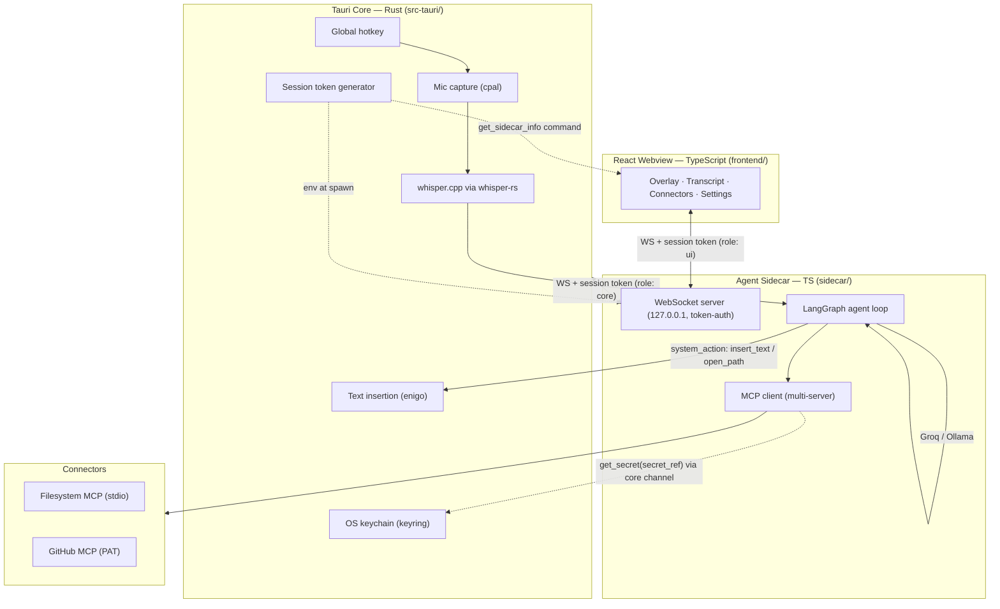

# Architecture

Four layers on one machine (PRD §5). The webview never touches OS APIs or secrets; the sidecar never renders UI.

## Key flows

- **Voice loop:** hotkey hold → cpal ring buffer (16kHz mono) → release → VAD trim → whisper_full → text → `user_utterance` over WS → LangGraph → tools/answer → `assistant_message`/`done` → transcript.
- **Confirm gate:** side-effecting tool → LangGraph `interrupt({tool, params})` → `confirm_request` → overlay card → `confirm_response {approved}` → resume (or "cancelled by user" ToolMessage on deny).
- **Secrets:** webview `store_secret` → keyring (service "vox") → config stores only `secret_ref`. Sidecar reads via `get_secret` on the privileged core channel; secrets never enter the webview or logs.
- **Session token:** 32 random bytes generated by Rust at startup; injected into sidecar via `VOX_SESSION_TOKEN` env; webview fetches `{port, token}` via `get_sidecar_info`. Sidecar binds `127.0.0.1:0` and prints the port on stdout; first WS frame must be `auth` or the socket is dropped.
- **System actions from the agent:** `open_path` / `insert_text` are LangGraph built-in tools that round-trip to Rust over the core channel (`system_action` → `system_result`).

## Windows

Two Tauri windows load the same Vite app on different routes:
- **main** (`/`) — 18px radius shell, sidebar (Home = session transcript, Connectors, Settings), hidden to tray on close.
- **overlay** (`/overlay`) — frameless, transparent, always-on-top, non-activating, bottom-center; mic pill (idle/listening/thinking), live transcription line, confirm card.

## Repo layout

See [IMPLEMENTATION_PLAN.md](../../IMPLEMENTATION_PLAN.md#repo-layout-target). Packages: `frontend/` (webview), `sidecar/` (agent), `packages/protocol/` (shared zod WS schemas), `src-tauri/` (Rust core).
